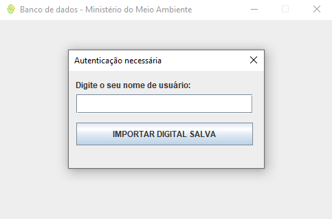
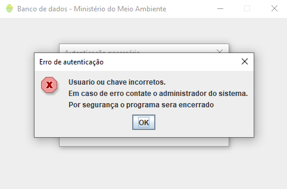
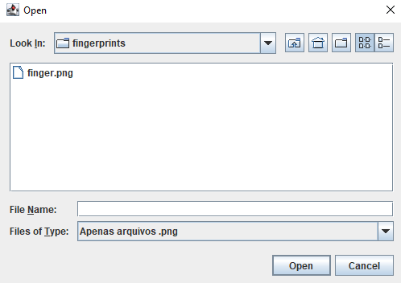
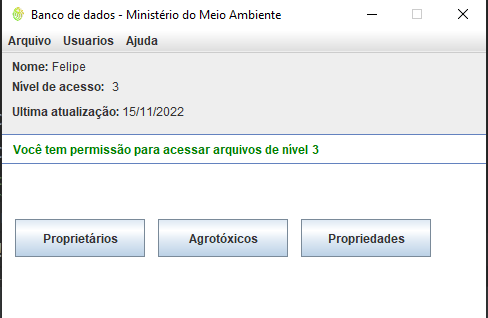
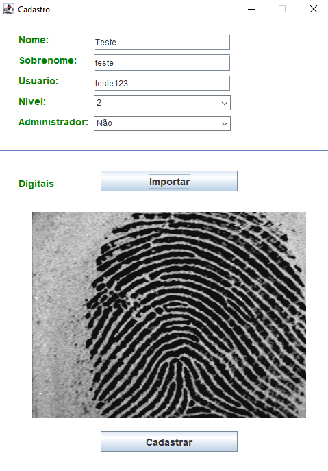
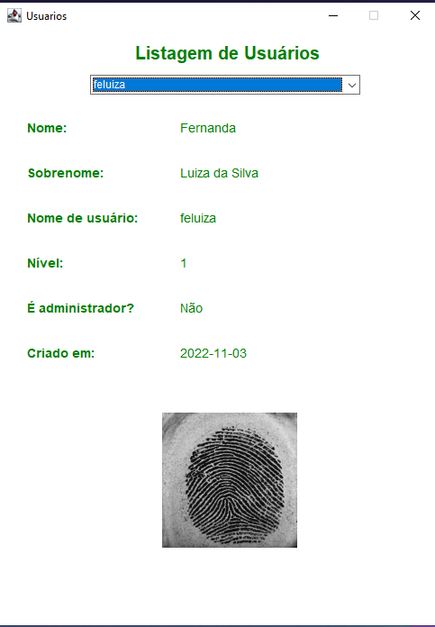
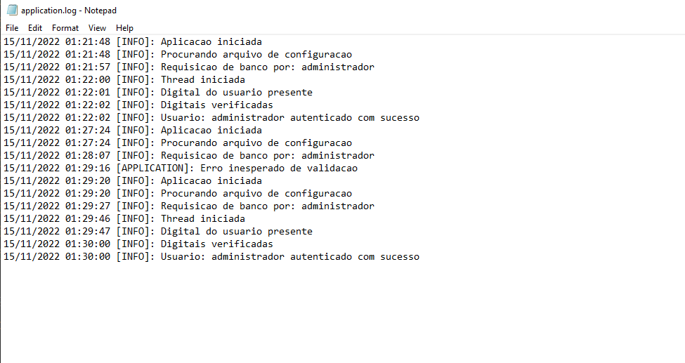

# APS - Biometria

### Requisitos
Pede-se aos alunos que desenvolvam em Java, C ou C# uma ferramenta de identificação e autenticação biométrica que restrinja o acesso a uma rede com banco dados do Ministério do Meio Ambiente. As informações são estratégicas sobre as propriedades rurais que utilizam agrotóxicos proibidos por causarem grandes impactos nos lenções freáticos, rios e mares. As informações de nível 1 todos podem ter acesso; as de nível 2 são restritas aos diretores de divisões; as de nível 3 somente são acessadas pelo ministro do meio ambiente.

### Sobre a aplicação

Ferramentas, frameworks e bibliotecas utilizadas
* IntelliJ IDEA 2022.1.4
* Java JDK 11 ou OpenJDK equivalente
* Maven (Gerenciador de dependências)
* SourceAFIS Algorithm - Impressão digital (https://sourceafis.machinezoo.com/java)
* SQLite3 - Banco de dados
* Compilado em ambiente Windows

### Funcionalidades

Ao iniciar a aplicaçao é verificado se o diretório contém um arquivo de configuração que verifica se o programa já foi
executado na máquina, caso não ele nunca tenha sido executado é configurado o banco de dados.
Lógo após é apresentado a tela de login.

Caso o usuário insira um nome de usuário que não esteja no banco de dados é exibido uma mensagem de erro.

O sistema exige o uso de uma digital salva em formato ".png"

A tela inicial contém informações como o nome do usuario, o nível de acesso e a data da ultima atualização.
Se o usuário for administrador ele pode cadastrar e verificar todos os usuários cadastrados no banco.
As informaçoes de proprietarios, agrotóxicos e propriedades são dependentes do nível de acesso do usuario.

É possivel cadastrar novos usuarios e verifica-los

 

O programa também gera logs que mais tarde podem ser usados para controle de acesso ou depuração de código.
 